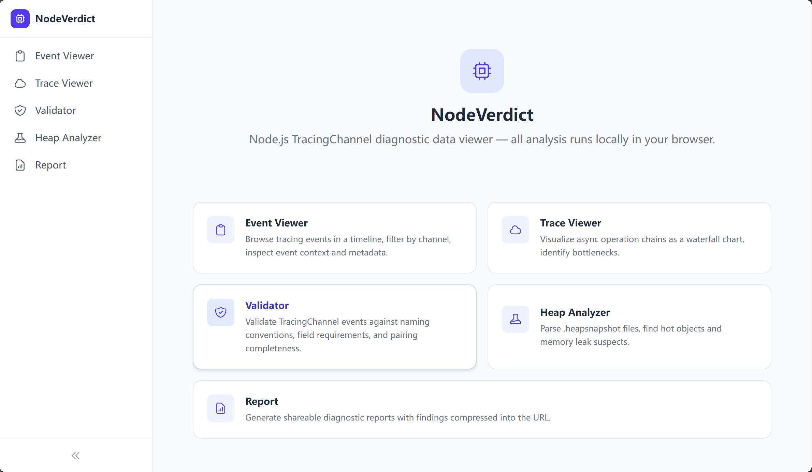
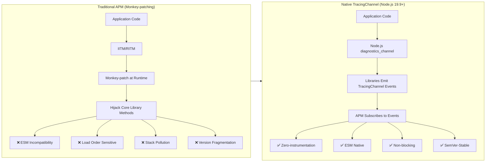
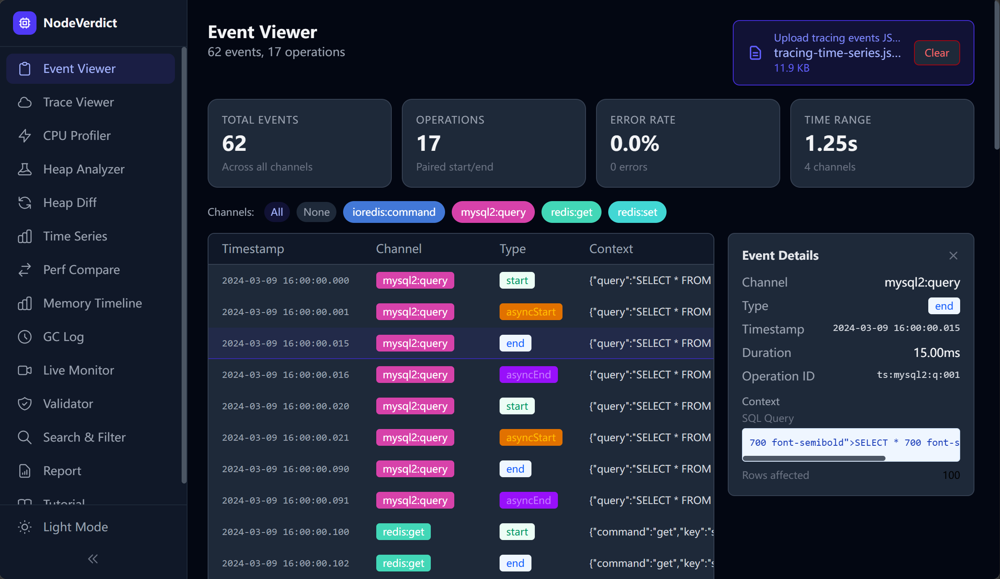
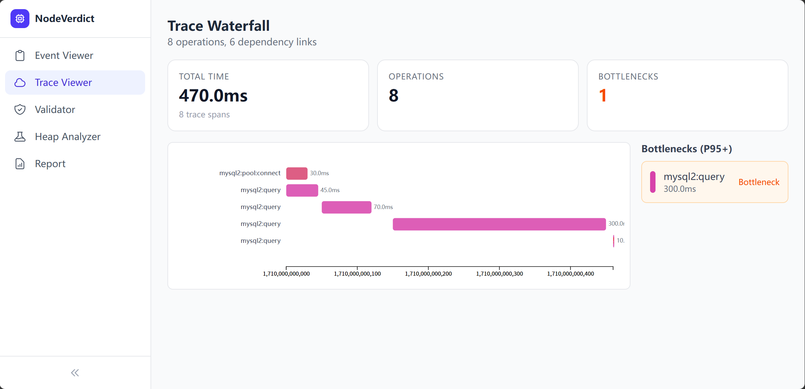
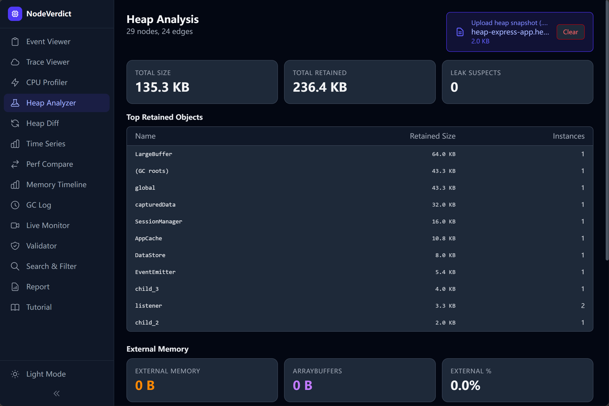
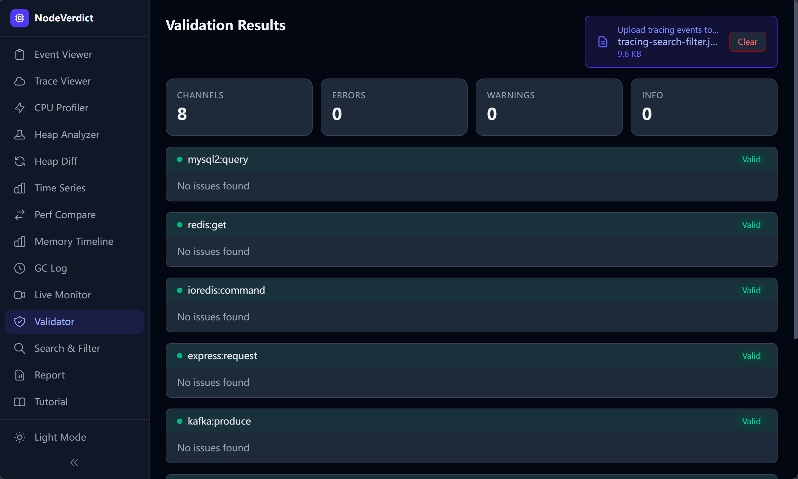
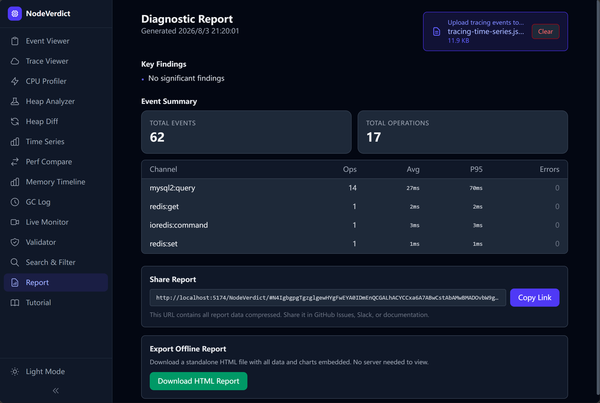
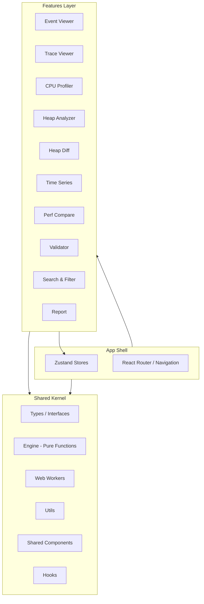

# NodeVerdict

> A browser-based **Node.js diagnostic data viewer** — consume TracingChannel native diagnostic events, analyze CPU profiles, inspect heap snapshots, compare performance data, and share findings — all locally in your browser.



[](LICENSE)
[](https://snowleopard-io.github.io/NodeVerdict/)

---

## Table of Contents

- [Why NodeVerdict](#why-nodeverdict)
- [Features](#features)
- [Getting Started](#getting-started)
- [Usage](#usage)
- [Architecture](#architecture)
- [Examples](#examples)
- [Browser Support](#browser-support)
- [Development](#development)
- [FAQ](#faq)
- [Ecosystem & Timing](#ecosystem--timing)
- [License](#license)

---

## Why NodeVerdict

The Node.js observability ecosystem is undergoing a **paradigm shift at the infrastructure level**. Existing APM tools rely on `import-in-the-middle` (IITM) and `require-in-the-middle` (RITM) to monkey-patch libraries — a fragile approach that breaks under ESM, conflicts with bundlers, and requires SDK initialization before any library is loaded.

Since Node.js 19.9, the built-in `diagnostics_channel.TracingChannel` API allows libraries to natively emit structured `start`/`end`/`asyncStart`/`asyncEnd`/`error` events. APM tools can subscribe directly — no patching required.

**NodeVerdict is built for this migration.** When mainstream libraries (mysql2, ioredis, pg, Express, etc.) natively support TracingChannel, the community needs an interactive frontend to consume and visualize these diagnostic events. The production side of the ecosystem is being built rapidly; the consumption side is still a blank canvas.



---

## Features

### 1. Diagnostic Event Viewer

Upload a JSON file of TracingChannel events and explore them in an interactive timeline.

- **Timeline View** — Chronological event list with color-coded channels
- **Channel Filter** — Filter by channel name (e.g., `mysql2:query`, `ioredis:command`)
- **Event Detail Panel** — Click any event to inspect its full context with smart rendering (SQL syntax highlighting, HTTP method badges, error stack traces, Redis command display)
- **Operation Aggregation** — Paired `start`/`end` events show complete operation duration and status



### 2. Trace Waterfall View

Visualize async operation chains using `asyncStart`/`asyncEnd` events.

- **Waterfall Chart** — D3.js-powered horizontal bar chart showing nested async operations, similar to Chrome DevTools Performance panel
- **Dependency Graph** — Causal relationships between operations (e.g., "Query A waits for pool connection → connection established → query executed")
- **Bottleneck Detection** — Automatically identifies P95+ slow operations



### 3. CPU Profiler (NEW)

Upload `.cpuprofile` files from Node.js (`--cpu-prof`) or Chrome DevTools to visualize CPU usage.

- **Interactive Flame Graph** — D3.js-powered flame graph with click-to-zoom, hover tooltips, and zoom history navigation
- **Hot Functions Table** — Sortable by Self Time or Total Time, showing hit counts and source file locations
- **Call Stack Visualization** — Full call tree traversal with colorful function blocks proportional to CPU time
- **Realistic Sample Data** — Includes `examples/cpu-profile-sample.cpuprofile` with typical Express app traffic patterns


### 4. Heap Snapshot Analyzer

Upload `.heapsnapshot` files from Node.js for memory analysis.

- **Hot Objects List** — Top objects sorted by retained size
- **Leak Detection** — Three rules automatically flag suspicious objects: unbounded cache growth, closure-captured large objects, event listener accumulation
- **GC Root Path** — Simplified path display from GC roots to selected objects



### 5. Heap Snapshot Diff (NEW)

Compare two `.heapsnapshot` files side-by-side to identify memory growth and new objects.

- **Dual Upload Panel** — Upload "before" and "after" snapshots independently
- **Delta Summary Cards** — Size Before/After, Size Delta, Object Delta
- **New / Growing / Removed** — Three categorized lists showing newly created object types, growing constructors, and freed types
- **Full Diff Table** — Sorted by absolute size delta, showing count and size changes for each constructor type

### 6. Time Series Analysis (NEW)

Visualize event throughput, latency distribution, and performance trends over time.

- **Throughput Chart** — D3.js bar chart showing events per time bucket, with error markers overlaid in red
- **Latency Distribution** — Histogram showing operation duration distribution (30 buckets)
- **Channel Latency Breakdown** — Table with P50, P95, P99, min, max, and average latency per channel
- **Summary Metrics** — Events/second throughput, average latency, P95 latency

### 7. Performance Comparison (NEW)

Compare two sets of tracing data to identify performance regressions or improvements.

- **Dual Dataset Upload** — Load "before" and "after" tracing event JSON files
- **Side-by-side Statistics** — Events, operations, error rate, and total duration for each dataset
- **Channel Comparison Table** — Per-channel average latency, delta, percentage change, and error count comparison
- **Visual Indicators** — Red for regressions (>5% slower), green for improvements (>5% faster)

### 8. Event Validator

For library maintainers and APM tool developers to verify TracingChannel implementation correctness.

- **Naming Convention Check** — Validates `{package}:{operation}` pattern
- **Required Field Validation** — Ensures context includes semantic fields (e.g., `db.query.text`, `server.address`)
- **Event Pairing Check** — Verifies every `start` has a matching `end`/`error`
- **Compatibility Check** — Validates alignment with OpenTelemetry semantic conventions



### 9. Search & Filter (NEW)

Advanced search and filtering across all tracing events.

- **Full-text Search** — Searches channel, context, and operationId fields
- **Regex Support** — Toggle regex mode for advanced pattern matching
- **Case-sensitive Toggle** — Control case sensitivity
- **Duration Range Filter** — Filter operations by min/max duration
- **Status Filter** — Filter by success, error, or incomplete operations
- **Time Range Filter** — Numerical timestamp range filtering
- **Real-time Results** — Live count of matching vs total events

### 10. Shareable Diagnostic Reports

Generate compressed reports encoded in the URL — share via GitHub Issues, Slack, or documentation.

- **Zero Infrastructure** — Reports are encoded in the URL hash using `lz-string` compression
- **One-Click Copy** — Copy the shareable link with a single button
- **Key Findings** — Auto-generated summaries (e.g., "mysql2:query avg 120ms, P95 450ms")
- **Offline HTML Export (NEW)** — Download a standalone HTML file with all data and charts embedded, styled like a professional report, no server needed to view



---

## Getting Started

### Prerequisites

- Node.js 18+
- npm 9+

### Installation

```bash
git clone https://github.com/your-username/node-verdict.git
cd node-verdict
npm install
```

### Development

```bash
npm run dev
```

Open [http://localhost:5173/node-verdict/](http://localhost:5173/node-verdict/) in your browser.

### Production Build

```bash
npm run build
npm run preview
```

The static build output is in the `dist/` directory, ready to deploy to GitHub Pages or any static hosting.

---

## Usage

### 1. Prepare Your Diagnostic Data

TracingChannel events should be exported as a JSON array. Each event follows this structure:

```typescript
interface TracingEvent {
  channel: string;           // e.g., "mysql2:query"
  eventType: 'start' | 'end' | 'asyncStart' | 'asyncEnd' | 'error';
  context: Record<string, any>;  // library-specific context
  timestamp: number;
  duration?: number;
  error?: { message: string; stack?: string; name?: string };
  operationId?: string;      // for cross-event correlation
}
```

CPU profile files should be exported from Node.js using `--cpu-prof` flag or Chrome DevTools' CPU profile export.

Heap snapshots should be generated using `node --heapsnapshot-signal` or `v8.writeHeapSnapshot()`.

### 2. Upload & Explore

Navigate to any feature page, upload your diagnostic file, and start exploring:

| Page | Data Type | Best For |
|------|-----------|----------|
| **Event Viewer** | Tracing events JSON | Browsing individual events, filtering by channel, smart context inspection |
| **Trace Viewer** | Tracing events JSON | Understanding async operation chains and bottlenecks |
| **CPU Profiler** | `.cpuprofile` | Finding hot functions, flame graph visualization |
| **Heap Analyzer** | `.heapsnapshot` | Memory leak investigation, hot object analysis |
| **Heap Diff** | `.heapsnapshot` (×2) | Comparing memory before/after to find growth |
| **Time Series** | Tracing events JSON | Throughput and latency distribution over time |
| **Perf Compare** | Tracing events JSON (×2) | A/B performance comparison, regression detection |
| **Validator** | Tracing events JSON | Debugging TracingChannel library implementations |
| **Search & Filter** | Tracing events JSON | Full-text search, regex, duration/status filtering |
| **Report** | Tracing events JSON | Generating shareable diagnostic summaries |

### 3. Share Results

Click **Report** → **Copy Link** to share your analysis as a URL. Recipients open the link and see the same results — no server, no installation.

For more comprehensive sharing, use the **Download HTML Report** button to export a standalone, self-contained HTML report file.

---

## Architecture

```
src/
├── shared/                          # Kernel (framework-agnostic)
│   ├── types/                       # TypeScript type definitions
│   │   ├── tracing.ts               # TracingChannel event types
│   │   ├── heap.ts                  # Heap snapshot types
│   │   ├── cpu-profile.ts           # CPU profile & flame graph types
│   │   └── report.ts                # Report data types
│   ├── engine/                      # Pipeline parsing engine (pure functions)
│   │   ├── tracing-parser.ts        # Tracing event parsing pipeline
│   │   ├── trace-aggregator.ts      # Waterfall building & bottleneck detection
│   │   ├── heap-parser.ts           # Heap snapshot parsing
│   │   ├── heap-diff.ts             # Heap snapshot comparison engine
│   │   ├── cpu-profile-parser.ts    # CPU profile parsing & flame tree building
│   │   ├── validator.ts             # Event format validator
│   │   └── report-generator.ts      # Report generation & compression
│   ├── workers/                     # Web Worker factory & handlers
│   ├── utils/                       # Formatting, I/O, helpers
│   ├── components/                  # Shared UI components
│   └── hooks/                       # Shared React hooks
├── features/                        # Feature modules (self-contained)
│   ├── event-viewer/                # Diagnostic Event Viewer
│   ├── trace-viewer/                # Waterfall & bottleneck analysis
│   ├── cpu-profiler/                # CPU Profile & flame graph
│   ├── heap-analyzer/               # Heap snapshot analyzer
│   ├── heap-diff/                   # Heap snapshot comparison
│   ├── time-series/                 # Time series & throughput analysis
│   ├── perf-compare/                # A/B performance comparison
│   ├── validator/                   # Event format validator
│   ├── search-filter/               # Advanced search & filtering
│   └── report/                      # Report generation & sharing
├── stores/                          # Zustand state management
└── app/                             # App shell, entry point, navigation
```



### Key Design Patterns

| Pattern | Description |
|---------|-------------|
| **Pipeline Engine** | `Normalize → Pair → Stats → Index` — each stage is a pure function, independently testable |
| **Store Slice** | Each feature registers its slice in a central Zustand store — no circular dependencies |
| **Worker Factory** | Type-safe generic worker client generated from handler functions |
| **Feature Isolation** | Each feature owns its components and logic, sharing only through the store |

---

## Examples

Sample data files are available in the [`examples/`](./examples) directory:

| File | Description | Try It On |
|------|-------------|-----------|
| `examples/tracing-events.json` | mysql2 + ioredis mixed events with a deadlock error | Event Viewer, Trace Viewer |
| `examples/tracing-multi-lib.json` | pg + KafkaJS + Express cross-library trace | Trace Viewer, Report |
| `examples/tracing-invalid.json` | Malformed data: orphan events, duplicate starts, bad naming | Validator |
| `examples/tracing-http-errors.json` | HTTP error scenarios (404/403/400/500, timeout, payload too large) | Event Viewer, Validator, Report |
| `examples/tracing-search-filter.json` | 40+ events across 8 channels: varied durations, errors, and statuses for search/filter testing | Search & Filter, Event Viewer |
| `examples/tracing-cross-lib.json` | Complex cross-library async chain: Express → Auth → Redis → MySQL → Kafka | Trace Viewer, Event Viewer |
| `examples/tracing-time-series.json` | Timestamp-spread events across 14 operations for throughput and latency distribution analysis | Time Series, Event Viewer |
| `examples/tracing-perf-before.json` | Baseline tracing data: 5 requests with untuned queries (slow JOIN, SELECT *, no cache) | Perf Compare, Trace Viewer |
| `examples/tracing-perf-after.json` | Optimized version: query improvements, column selection, 7-day filter, ~40-50% latency reduction | Perf Compare, Trace Viewer |
| `examples/cpu-profile-sample.cpuprofile` | 400-sample CPU profile simulating Express app with DB queries, auth, and caching | CPU Profiler |
| `examples/heap-sample.heapsnapshot` | Minimal 5-node heap snapshot chain (AppCache → DataStore → SessionManager → LargeBuffer) | Heap Analyzer |
| `examples/heap-express-app.heapsnapshot` | Realistic Express app heap: closures, event listeners, large buffers, cache entries | Heap Analyzer, Heap Diff |
| `examples/heap-diff-before.heapsnapshot` | Before snapshot: 11 nodes with small cache (2 entries) and session store | Heap Diff |
| `examples/heap-diff-after.heapsnapshot` | After snapshot: 18 nodes with grown cache (4 entries) + leaked event listeners | Heap Diff |
| `examples/heap-string-leak.heapsnapshot` | 22-node heap with concatenated strings, sliced strings, and large string cache to test string analysis | Heap Analyzer |
| `examples/memory-timeline.json` | 16-point process.memoryUsage() time series showing steady external/RSS/heap growth over 15s | Memory Timeline |
| `examples/gc-trace-gc.log` | 33 GC events (Scavenge + Mark-sweep) over 15 seconds, showing 4x heap growth | GC Log Analyzer |

### Quick Start Guide

**New to NodeVerdict?** Try these scenarios in order:

1. **Event Viewer basics** → Upload `examples/tracing-events.json` to see the timeline
2. **CPU Profiling** → Upload `examples/cpu-profile-sample.cpuprofile` to explore the flame graph
3. **Memory Analysis** → Upload `examples/heap-sample.heapsnapshot` to see leak detection
4. **Heap Diff** → Upload `examples/heap-diff-before.heapsnapshot` and `heap-diff-after.heapsnapshot` in Heap Diff to compare memory growth
5. **Performance Comparison** → Upload `examples/tracing-perf-before.json` and `tracing-perf-after.json` in Perf Compare to see the optimization impact
6. **Time Series** → Upload `examples/tracing-time-series.json` to visualize throughput patterns
7. **Cross-Library Trace** → Upload `examples/tracing-cross-lib.json` in Trace Viewer to see the waterfall chart
8. **Search & Filter** → Upload `examples/tracing-search-filter.json` to test full-text search, regex, and duration filtering
9. **Share Results** → Upload any tracing data and go to Report to generate a shareable link or download HTML
10. **Memory Timeline** → Upload `examples/memory-timeline.json` to visualize external memory growth and RSS/heap trends over time
11. **GC Log Analysis** → Upload `examples/gc-trace-gc.log` to analyze GC pause times and external memory pressure
12. **String Leak Detection** → Upload `examples/heap-string-leak.heapsnapshot` in Heap Analyzer to see external memory stats and string analysis

---

## Browser Support

| Browser | Support |
|---------|---------|
| Chrome 80+ | ✅ Full |
| Firefox 80+ | ✅ Full |
| Safari 14+ | ✅ Full |
| Edge 80+ | ✅ Full |

---

## Development

### Project Scripts

| Command | Description |
|---------|-------------|
| `npm run dev` | Start Vite dev server with HMR |
| `npm run build` | TypeScript check + production build |
| `npm run preview` | Preview production build locally |

### Tech Stack

| Component | Choice | Rationale |
|-----------|--------|-----------|
| UI Framework | React + TypeScript | Stable ecosystem |
| Build Tool | Vite | Fast HMR, GitHub Pages friendly |
| Styling | Tailwind CSS v4 | Utility-first, rapid UI development |
| State | Zustand | Minimal boilerplate, slice-friendly |
| Compression | lz-string | URL-friendly report sharing |
| Visualization | D3.js (flame graph, waterfall, charting) / ECharts (overview) | Purpose-built for each chart type |

---

## FAQ

**Q: Does this send my data anywhere?**  
A: No. All analysis runs entirely in your browser. No data is uploaded to any server.

**Q: What file formats are supported?**  
A: JSON files for TracingChannel events (up to 50MB), `.heapsnapshot` files for heap analysis (up to 200MB), `.cpuprofile` files for CPU profiling (up to 50MB), memory usage JSON arrays for Memory Timeline, and `--trace-gc` log files for GC analysis.

**Q: Can I use this for production monitoring?**  
A: No. This is designed for development debugging, offline analysis, and post-mortem investigation. It complements rather than replaces production APM tools.

**Q: How do I generate TracingChannel events from my Node.js application?**  
A: Subscribe to `diagnostics_channel` channels in your Node.js application and export the captured events as JSON. See [Node.js diagnostics_channel docs](https://nodejs.org/api/diagnostics_channel.html) for details.

**Q: How do I generate a CPU profile for analysis?**  
A: Run your Node.js application with `--cpu-prof` flag: `node --cpu-prof app.js`. This generates a `.cpuprofile` file. Alternatively, use Chrome DevTools' Performance tab → "Start profiling" → "Download CPU profile".

**Q: How do I generate a heap snapshot?**  
A: Use `node --heapsnapshot-signal=SIGUSR2 app.js` and send the signal, or call `v8.writeHeapSnapshot()` in your code. The `.heapsnapshot` file can be loaded directly into NodeVerdict.

**Q: What is the difference between Heap Analyzer and Heap Diff?**  
A: Heap Analyzer examines a single snapshot for hot objects and leak suspects. Heap Diff compares two snapshots (before/after) to find memory growth, new object types, and freed memory.

**Q: What does the Perf Compare feature show?**  
A: It compares two tracing event datasets side-by-side. You can see per-channel latency changes, error rate differences, and overall duration deltas — useful for A/B testing performance optimizations.

**Q: Can I search across events with regex?**  
A: Yes. The Search & Filter page supports regular expression mode, case-sensitive toggling, duration range, status filter, and time range filtering.

**Q: What information is included in the offline HTML report?**  
A: The exported HTML report includes key findings, per-channel statistics (ops, avg, P95, errors), heap analysis summary (if available), and professional styling — all in a single self-contained file.

---

## Ecosystem & Timing

The TracingChannel API has been available since Node.js 18, but meaningful ecosystem adoption only began in late 2025. Key library migration status:

| Library | Status | Weekly Downloads |
|---------|--------|-----------------|
| mysql2 | ✅ Merged (v3.20.0) | ~60M+ |
| node-redis | ✅ Merged | ~60M+ |
| ioredis | ✅ Merged | ~60M+ |
| pg (PostgreSQL) | 🔄 PR Open | Mainstream |
| Express | 🔄 PR Open | Mainstream |
| GraphQL | 🔄 PR Open | Mainstream |
| 44+ libraries tracked | 10 merged, 4 PR open, 8 in discussion, 22 not started | |

**Key insight**: When mysql2 shipped TracingChannel support, the community independently built `mysql2-otel-instrumentation` — a pure `diagnostics_channel` subscriber replacing the monkey-patched `@opentelemetry/instrumentation-mysql2`. This demonstrates that once libraries natively support TracingChannel, the subscriber ecosystem emerges naturally — but the tooling to debug and visualize these events was still missing.

---

## License

[MIT](LICENSE)

---

## Contributing

Contributions are welcome! Please open an issue or submit a PR for any bugs, features, or improvements.