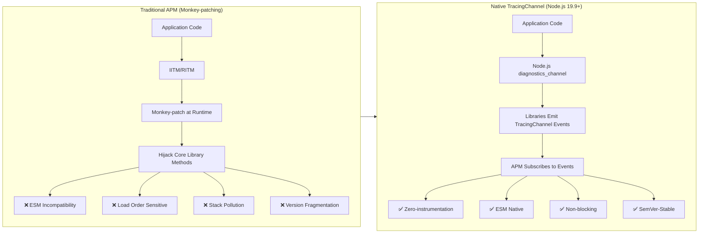
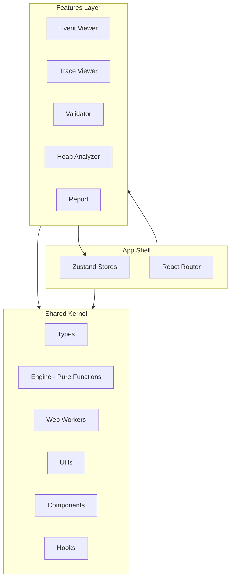

# NodeVerdict

> A browser-based **Node.js diagnostic data viewer** — consume TracingChannel native diagnostic events, analyze heap snapshots, and share findings — all locally in your browser.


[](LICENSE)
[](https://snowleopard-io.github.io/NodeVerdict/)

---

## Table of Contents

- [Why NodeVerdict](#why-nodeverdict)
- [Features](#features)
- [Getting Started](#getting-started)
- [Usage](#usage)
- [Architecture](#architecture)
- [Examples](#examples)
- [Browser Support](#browser-support)
- [Development](#development)
- [FAQ](#faq)
- [Ecosystem & Timing](#ecosystem--timing)
- [License](#license)

---

## Why NodeVerdict

The Node.js observability ecosystem is undergoing a **paradigm shift at the infrastructure level**. Existing APM tools rely on `import-in-the-middle` (IITM) and `require-in-the-middle` (RITM) to monkey-patch libraries — a fragile approach that breaks under ESM, conflicts with bundlers, and requires SDK initialization before any library is loaded.

Since Node.js 19.9, the built-in `diagnostics_channel.TracingChannel` API allows libraries to natively emit structured `start`/`end`/`asyncStart`/`asyncEnd`/`error` events. APM tools can subscribe directly — no patching required.

**Diagnosis Workbench is built for this migration.** When mainstream libraries (mysql2, ioredis, pg, Express, etc.) natively support TracingChannel, the community needs an interactive frontend to consume and visualize these diagnostic events. The production side of the ecosystem is being built rapidly; the consumption side is still a blank canvas.



---

## Features

### 1. Diagnostic Event Viewer

Upload a JSON file of TracingChannel events and explore them in an interactive timeline.

- **Timeline View** — Chronological event list with color-coded channels
- **Channel Filter** — Filter by channel name (e.g., `mysql2:query`, `ioredis:command`)
- **Event Detail Panel** — Click any event to inspect its full context (query, parameters, result set, etc.)
- **Operation Aggregation** — Paired `start`/`end` events show complete operation duration and status


### 2. Trace Waterfall View

Visualize async operation chains using `asyncStart`/`asyncEnd` events.

- **Waterfall Chart** — D3.js-powered horizontal bar chart showing nested async operations, similar to Chrome DevTools Performance panel
- **Dependency Graph** — Causal relationships between operations (e.g., "Query A waits for pool connection → connection established → query executed")
- **Bottleneck Detection** — Automatically identifies P95+ slow operations


### 3. Event Validator

For library maintainers and APM tool developers to verify TracingChannel implementation correctness.

- **Naming Convention Check** — Validates `{package}:{operation}` pattern
- **Required Field Validation** — Ensures context includes semantic fields (e.g., `db.query.text`, `server.address`)
- **Event Pairing Check** — Verifies every `start` has a matching `end`/`error`
- **Compatibility Check** — Validates alignment with OpenTelemetry semantic conventions


### 4. Heap Snapshot Analyzer

Upload `.heapsnapshot` files from Node.js for memory analysis.

- **Hot Objects List** — Top objects sorted by retained size
- **Leak Detection** — Three rules automatically flag suspicious objects: unbounded cache growth, closure-captured large objects, event listener accumulation
- **GC Root Path** — Simplified path display from GC roots to selected objects


### 5. Shareable Diagnostic Reports

Generate compressed reports encoded in the URL — share via GitHub Issues, Slack, or documentation.

- **Zero Infrastructure** — Reports are encoded in the URL hash using `lz-string` compression
- **One-Click Copy** — Copy the shareable link with a single button
- **Key Findings** — Auto-generated summaries (e.g., "mysql2:query avg 120ms, P95 450ms")


---

## Getting Started

### Prerequisites

- Node.js 18+
- npm 9+

### Installation

```bash
git clone https://github.com/your-username/node-verdict.git
cd node-verdict
npm install
```

### Development

```bash
npm run dev
```

Open [http://localhost:5173/node-verdict/](http://localhost:5173/node-verdict/) in your browser.

### Production Build

```bash
npm run build
npm run preview
```

The static build output is in the `dist/` directory, ready to deploy to GitHub Pages or any static hosting.

---

## Usage

### 1. Prepare Your Diagnostic Data

TracingChannel events should be exported as a JSON array. Each event follows this structure:

```typescript
interface TracingEvent {
  channel: string;           // e.g., "mysql2:query"
  eventType: 'start' | 'end' | 'asyncStart' | 'asyncEnd' | 'error';
  context: Record<string, any>;  // library-specific context
  timestamp: number;
  duration?: number;
  error?: { message: string; stack?: string; name?: string };
  operationId?: string;      // for cross-event correlation
}
```

### 2. Upload & Explore

Navigate to any feature page, upload your JSON file, and start exploring:

| Page | Best For |
|------|----------|
| **Event Viewer** | Browsing individual events, filtering by channel |
| **Trace Viewer** | Understanding async operation chains and bottlenecks |
| **Validator** | Debugging TracingChannel library implementations |
| **Heap Analyzer** | Memory leak investigation from `.heapsnapshot` files |
| **Report** | Generating shareable diagnostic summaries |

### 3. Share Results

Click **Report** → **Copy Link** to share your analysis as a URL. Recipients open the link and see the same results — no server, no installation.

---

## Architecture

```
src/
├── shared/                          # Kernel (framework-agnostic)
│   ├── types/                       # TypeScript type definitions
│   ├── engine/                      # Pipeline parsing engine (pure functions)
│   ├── workers/                     # Web Worker factory & handlers
│   ├── utils/                       # Formatting, I/O, helpers
│   ├── components/                  # Shared UI components
│   └── hooks/                       # Shared React hooks
├── features/                        # Feature modules (self-contained)
│   ├── event-viewer/                # Diagnostic Event Viewer
│   ├── trace-viewer/                # Waterfall & bottleneck analysis
│   ├── validator/                   # Event format validator
│   ├── heap-analyzer/               # Heap snapshot analyzer
│   └── report/                      # Report generation & sharing
├── stores/                          # Zustand state management
└── app/                             # App shell, entry point
```



### Key Design Patterns

| Pattern | Description |
|---------|-------------|
| **Pipeline Engine** | `Normalize → Pair → Stats → Index` — each stage is a pure function, independently testable |
| **Store Slice** | Each feature registers its slice in a central Zustand store — no circular dependencies |
| **Worker Factory** | Type-safe generic worker client generated from handler functions |
| **Feature Isolation** | Each feature owns its components and logic, sharing only through the store |

---

## Examples

Sample data files are available in the [`examples/`](./examples) directory:

| File | Description | Try It On |
|------|-------------|-----------|
| `examples/tracing-events.json` | mysql2 + ioredis mixed events with a deadlock error | Event Viewer, Trace Viewer |
| `examples/tracing-multi-lib.json` | pg + KafkaJS + Express cross-library trace | Trace Viewer, Report |
| `examples/tracing-invalid.json` | Malformed data: orphan events, duplicate starts, bad naming | Validator |
| `examples/tracing-http-errors.json` | HTTP error scenarios (404/403/400/500, timeout, payload too large) | Event Viewer, Validator, Report |
| `examples/heap-sample.heapsnapshot` | Minimal 5-node heap snapshot chain (AppCache → DataStore → SessionManager → LargeBuffer) | Heap Analyzer |
| `examples/heap-express-app.heapsnapshot` | Realistic Express app heap: closures, event listeners, large buffers, cache entries | Heap Analyzer |

---

## Browser Support

| Browser | Support |
|---------|---------|
| Chrome 80+ | ✅ Full |
| Firefox 80+ | ✅ Full |
| Safari 14+ | ✅ Full |
| Edge 80+ | ✅ Full |

---

## Development

### Project Scripts

| Command | Description |
|---------|-------------|
| `npm run dev` | Start Vite dev server with HMR |
| `npm run build` | TypeScript check + production build |
| `npm run preview` | Preview production build locally |

### Tech Stack

| Component | Choice | Rationale |
|-----------|--------|-----------|
| UI Framework | React + TypeScript | Stable ecosystem |
| Build Tool | Vite | Fast HMR, GitHub Pages friendly |
| Styling | Tailwind CSS v4 | Utility-first, rapid UI development |
| State | Zustand | Minimal boilerplate, slice-friendly |
| Compression | lz-string | URL-friendly report sharing |
| Visualization | D3.js (waterfall) / ECharts (overview) | Purpose-built for each chart type |

---

## FAQ

**Q: Does this send my data anywhere?**  
A: No. All analysis runs entirely in your browser. No data is uploaded to any server.

**Q: What file formats are supported?**  
A: JSON files for TracingChannel events (up to 50MB) and `.heapsnapshot` files for heap analysis (up to 200MB).

**Q: Can I use this for production monitoring?**  
A: No. This is designed for development debugging, offline analysis, and post-mortem investigation. It complements rather than replaces production APM tools.

**Q: How do I generate TracingChannel events from my Node.js application?**  
A: Subscribe to `diagnostics_channel` channels in your Node.js application and export the captured events as JSON. See [Node.js diagnostics_channel docs](https://nodejs.org/api/diagnostics_channel.html) for details.

---

## Ecosystem & Timing

The TracingChannel API has been available since Node.js 18, but meaningful ecosystem adoption only began in late 2025. Key library migration status:

| Library | Status | Weekly Downloads |
|---------|--------|-----------------|
| mysql2 | ✅ Merged (v3.20.0) | ~60M+ |
| node-redis | ✅ Merged | ~60M+ |
| ioredis | ✅ Merged | ~60M+ |
| pg (PostgreSQL) | 🔄 PR Open | Mainstream |
| Express | 🔄 PR Open | Mainstream |
| GraphQL | 🔄 PR Open | Mainstream |
| 44+ libraries tracked | 10 merged, 4 PR open, 8 in discussion, 22 not started | |

**Key insight**: When mysql2 shipped TracingChannel support, the community independently built `mysql2-otel-instrumentation` — a pure `diagnostics_channel` subscriber replacing the monkey-patched `@opentelemetry/instrumentation-mysql2`. This demonstrates that once libraries natively support TracingChannel, the subscriber ecosystem emerges naturally — but the tooling to debug and visualize these events was still missing.

---

## License

[MIT](LICENSE)

---

## Contributing

Contributions are welcome! Please open an issue or submit a PR for any bugs, features, or improvements.