# NodeVerdict

> 一款基于浏览器的 **Node.js 诊断数据查看器** — 消费 TracingChannel 原生诊断事件、分析 CPU 性能分析文件、检查堆快照、比较性能数据、分享诊断结果 — 全部在本地浏览器中完成。


[](LICENSE)
[](https://snowleopard-io.github.io/NodeVerdict/)

---

## 目录

- [为什么选择 NodeVerdict](#为什么选择-nodeverdict)
- [特性](#特性)
- [快速开始](#快速开始)
- [使用指南](#使用指南)
- [架构](#架构)
- [示例](#示例)
- [浏览器支持](#浏览器支持)
- [开发](#开发)
- [常见问题](#常见问题)
- [生态与时机](#生态与时机)
- [许可证](#许可证)

---

## 为什么选择 NodeVerdict

Node.js 可观测性生态正在经历一场**基础设施层面的范式转变**。现有的 APM 工具依赖 `import-in-the-middle`（IITM）和 `require-in-the-middle`（RITM）对库进行猴子补丁——这种方式脆弱且不兼容 ESM、与打包工具冲突，且需要在任何库加载之前初始化 SDK。

自 Node.js 19.9 起，内置的 `diagnostics_channel.TracingChannel` API 允许库原生发出结构化的 `start`/`end`/`asyncStart`/`asyncEnd`/`error` 事件。APM 工具可以直接订阅——无需任何补丁。

**NodeVerdict 正是为这一迁移而构建。** 当主流库（mysql2、ioredis、pg、Express 等）原生支持 TracingChannel 时，社区需要一个交互式前端来消费和可视化这些诊断事件。生态的生产侧正在快速建设中；而消费侧仍是一片空白。

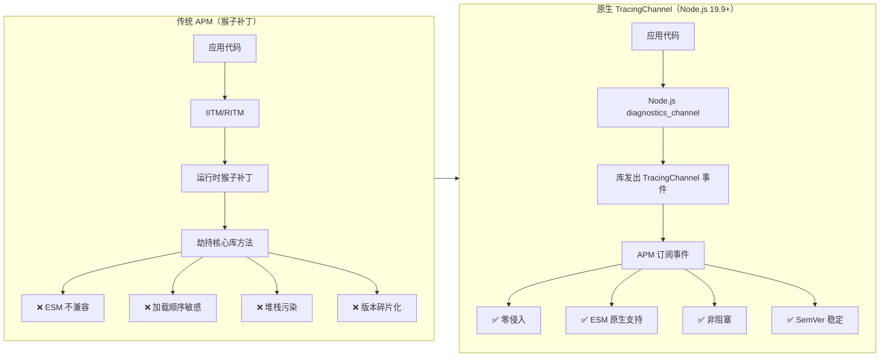

---

## 特性

### 1. 诊断事件查看器

上传 TracingChannel 事件的 JSON 文件，在交互式时间线中探索它们。

- **时间线视图** — 按时间顺序排列的事件列表，带颜色编码的通道标记
- **通道筛选** — 按通道名称筛选（如 `mysql2:query`、`ioredis:command`）
- **事件详情面板** — 点击任意事件查看完整上下文，支持智能渲染（SQL 语法高亮、HTTP 方法徽章、错误堆栈跟踪、Redis 命令展示）
- **操作聚合** — 配对的 `start`/`end` 事件显示完整操作耗时和状态


### 2. 跟踪瀑布图

使用 `asyncStart`/`asyncEnd` 事件可视化异步操作链。

- **瀑布图** — 基于 D3.js 的水平条形图，展示嵌套的异步操作，类似 Chrome DevTools 的 Performance 面板
- **依赖关系图** — 操作之间的因果关系（例如"查询 A 等待连接池 → 连接建立 → 查询执行"）
- **瓶颈检测** — 自动识别 P95+ 慢操作


### 3. CPU 性能分析器（新增）

上传来自 Node.js（`--cpu-prof`）或 Chrome DevTools 的 `.cpuprofile` 文件，可视化 CPU 使用情况。

- **交互式火焰图** — 基于 D3.js 的火焰图，支持点击缩放、悬停提示和缩放历史导航
- **热点函数表** — 可按自身耗时或总耗时排序，展示命中次数和源文件位置
- **调用栈可视化** — 完整的调用树遍历，用彩色函数块按 CPU 时间比例展示
- **真实示例数据** — 包含 `examples/cpu-profile-sample.cpuprofile`，模拟典型 Express 应用流量模式

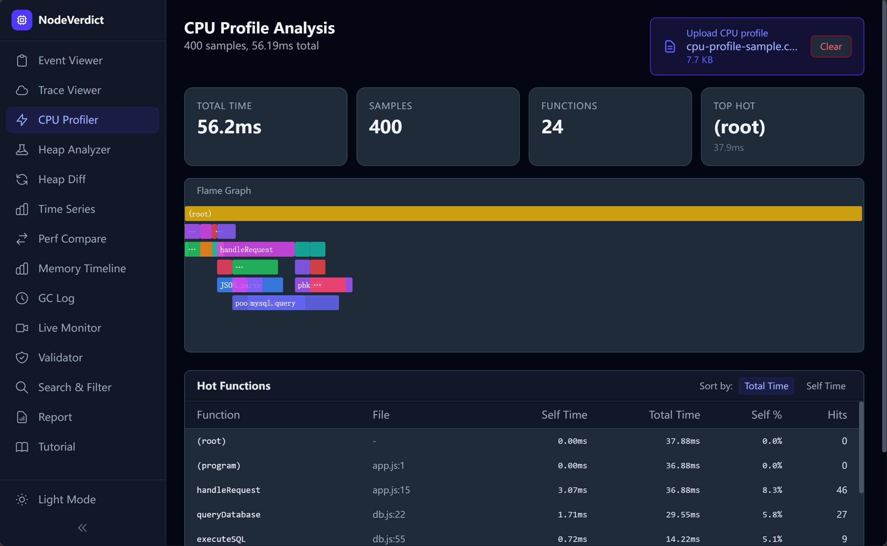

### 4. 堆快照分析器

上传来自 Node.js 的 `.heapsnapshot` 文件进行内存分析。

- **热点对象列表** — 按保留大小排序的顶级对象
- **泄漏检测** — 三条规则自动标记可疑对象：无界缓存增长、闭包捕获大对象、事件监听器累积
- **GC 根路径** — 从 GC 根到选定对象的简化路径展示


### 5. 堆快照对比（新增）

并排比较两个 `.heapsnapshot` 文件，识别内存增长和新对象。

- **双面板上传** — 独立上传"前"和"后"快照
- **差异摘要卡片** — 前后大小、大小差异、对象差异
- **新增 / 增长 / 移除** — 三个分类列表，展示新创建的对象类型、增长的构造函数和释放的类型
- **完整差异表** — 按绝对大小差异排序，展示每个构造函数类型的数量和大小变化

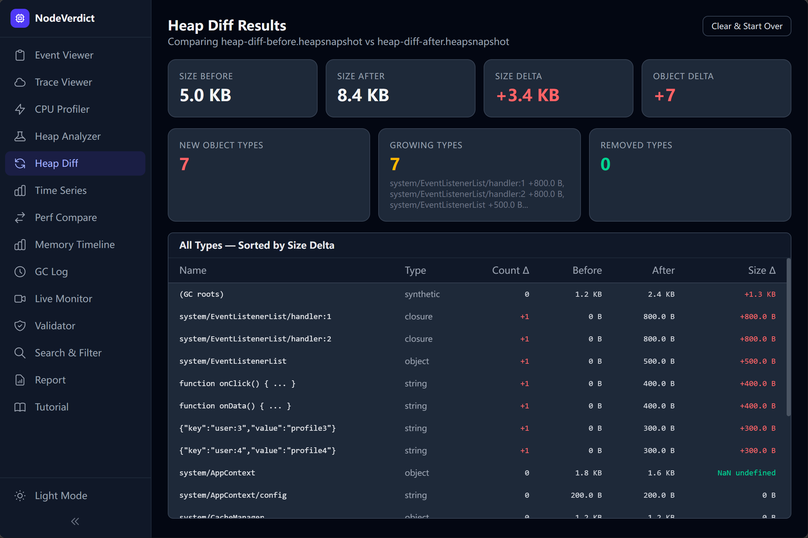

### 6. 时间序列分析（新增）

可视化事件吞吐量、延迟分布和随时间的性能趋势。

- **吞吐量图表** — 基于 D3.js 的柱状图，展示每个时间桶内的事件数量，错误标记用红色叠加
- **延迟分布** — 直方图展示操作耗时分布（30 个桶）
- **通道延迟分解表** — 每个通道的 P50、P95、P99、最小值、最大值和平均延迟
- **摘要指标** — 每秒事件吞吐量、平均延迟、P95 延迟

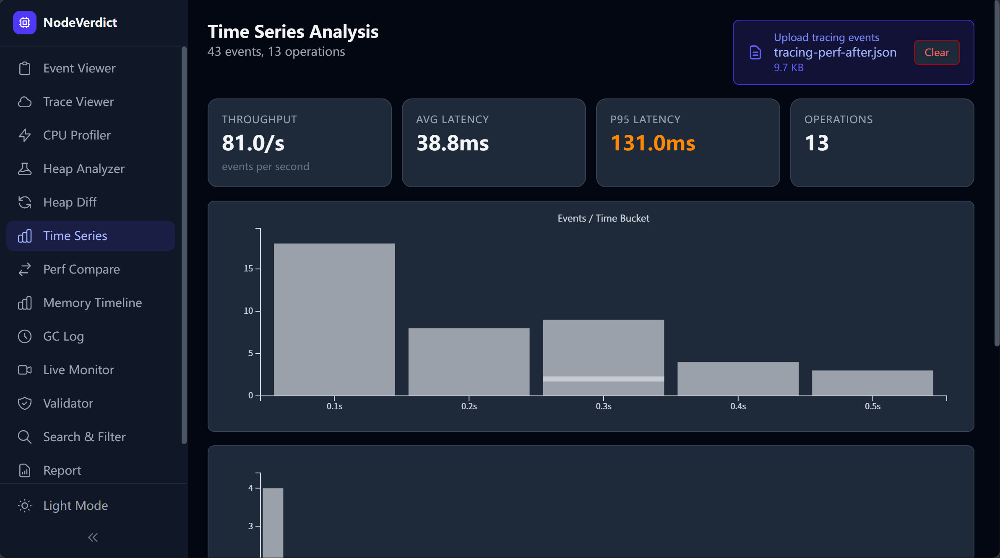

### 7. 性能对比（新增）

比较两组跟踪数据，识别性能回退或改进。

- **双数据集上传** — 加载"前"和"后"跟踪事件 JSON 文件
- **并排统计** — 每个数据集的事件数、操作数、错误率和总耗时
- **通道对比表** — 按通道对比平均延迟、差异、百分比变化和错误数量
- **可视化指示器** — 红色表示回退（慢 >5%），绿色表示改进（快 >5%）

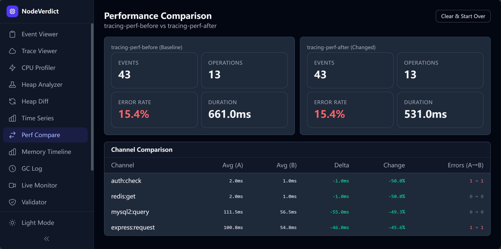

### 8. 事件验证器

为库维护者和 APM 工具开发者提供，用于验证 TracingChannel 实现的正确性。

- **命名规范检查** — 验证 `{package}:{operation}` 格式
- **必填字段验证** — 确保上下文包含语义字段（如 `db.query.text`、`server.address`）
- **事件配对检查** — 验证每个 `start` 都有匹配的 `end`/`error`
- **兼容性检查** — 验证与 OpenTelemetry 语义约定的一致性


### 9. 搜索与筛选（新增）

在所有跟踪事件中进行高级搜索和筛选。

- **全文搜索** — 搜索通道、上下文和 operationId 字段
- **正则表达式支持** — 切换正则模式进行高级模式匹配
- **大小写切换** — 控制大小写敏感性
- **耗时范围筛选** — 按最小/最大耗时筛选操作
- **状态筛选** — 按成功、错误或不完整操作筛选
- **时间范围筛选** — 数值时间戳范围筛选
- **实时结果** — 匹配事件数与总事件数的实时计数

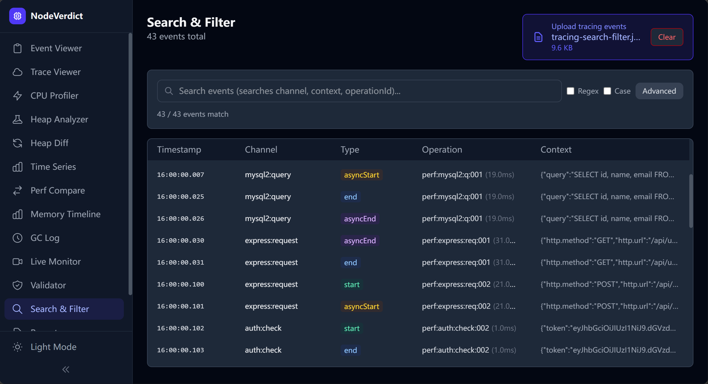

### 10. 可分享的诊断报告

生成压缩报告并编码到 URL 中——通过 GitHub Issues、Slack 或文档分享。

- **零基础设施** — 报告使用 `lz-string` 压缩编码在 URL 哈希中
- **一键复制** — 单击按钮即可复制可分享链接
- **关键发现** — 自动生成的摘要（如"mysql2:query 平均 120ms，P95 450ms"）
- **离线 HTML 导出（新增）** — 下载独立的 HTML 文件，包含所有数据和图表，样式如同专业报告，无需服务器即可查看


### 11. 内存时间线（新增）

上传 `process.memoryUsage()` 时间序列数据，可视化随时间变化的内存增长趋势。

- **D3.js 折线图** — 三条叠加线条（RSS、heapUsed、external），带相对时间轴（秒）和 MB 单位
- **增长率告警** — 线性回归计算检测异常内存增长（>1 MB/s 标记为异常）
- **数据表格** — 所有内存快照的可滚动详情表格，便于精确查看

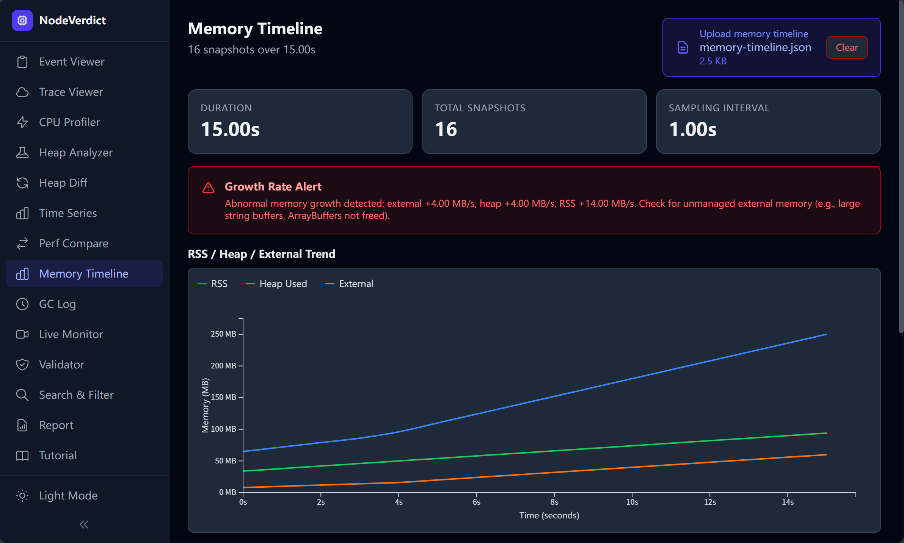

### 12. GC 日志分析器（新增）

解析 V8 `--trace-gc` 日志文件，分析垃圾回收行为和外部内存压力。

- **GC 统计卡片** — GC 总次数、Major（Mark-sweep）次数、Minor（Scavenge）次数、总暂停时间
- **外部内存警告** — 标记堆增长 >50MB 为潜在未管理内存
- **事件表格** — 所有 GC 事件按时间排序，包含类型、暂停时间和堆大小变化

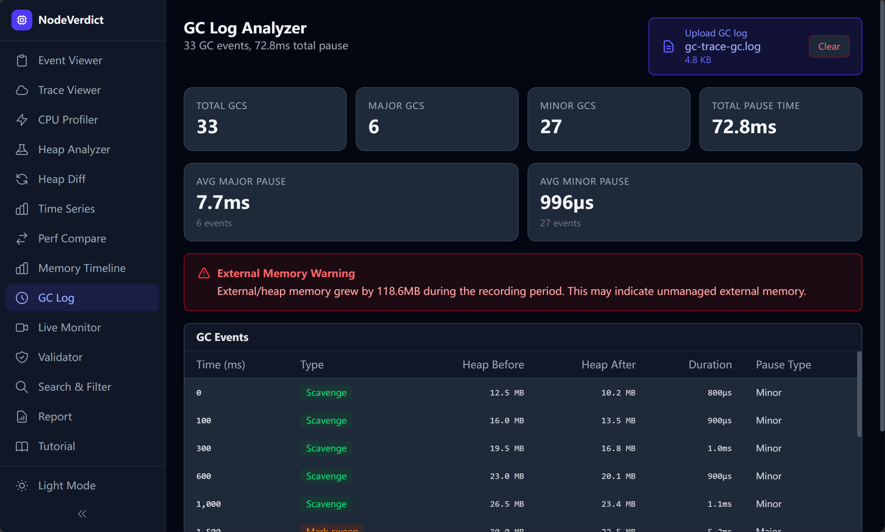

### 13. 实时监控（新增）

通过 WebSocket 实时连接到正在运行的 Node.js 进程——无需重启，无需转储文件。

- **实时内存轮询** — RSS、heapUsed、heapTotal、external 在实时更新的统计卡片上展示
- **实时 TracingChannel 事件** — 流式事件展示，带通道徽章和时间戳
- **按需诊断** — 随时获取堆快照或 CPU 性能分析文件，并下载为文件
- **代理协议** — 使用 `NodeVerdict Live Agent`（`server/live-agent.mjs`），该代理订阅 `diagnostics_channel` 事件和 inspector API

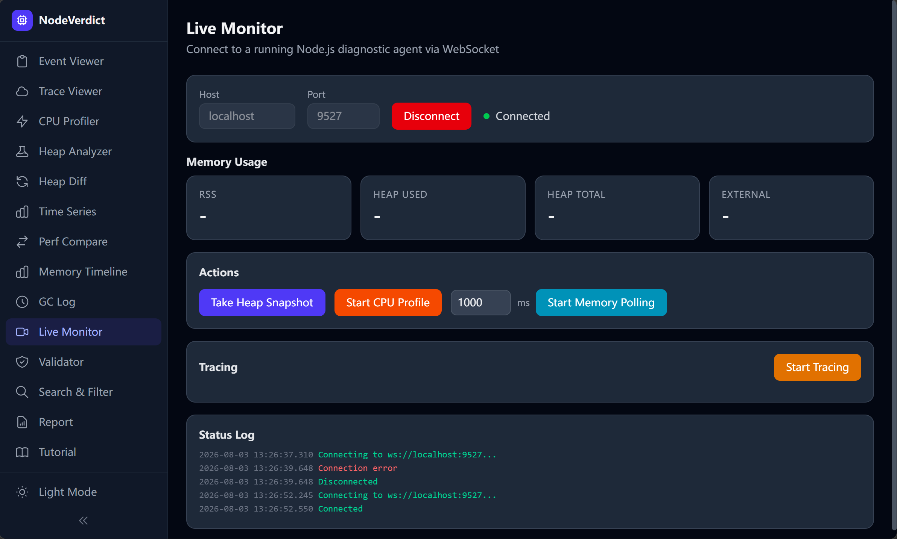

### 14. 教程

内置交互式指南，涵盖如何从 Node.js 项目生成诊断数据以及如何使用所有 NodeVerdict 功能。

- **基于 Markdown** — 分步说明，包含 TracingChannel、CPU 性能分析、堆快照等代码示例
- **功能讲解** — 应用中每个页面的详细使用指南
- **示例文件参考** — 全部 17 个示例文件的完整表格及推荐学习路径

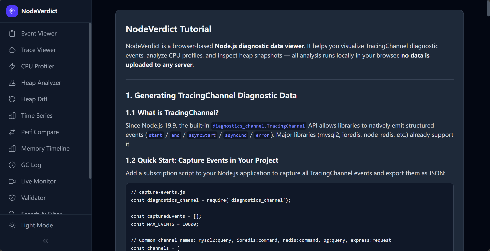

---

## 快速开始

### 前提条件

- Node.js 18+
- npm 9+

### 安装

```bash
git clone https://github.com/your-username/node-verdict.git
cd node-verdict
npm install
```

### 开发

```bash
npm run dev
```

在浏览器中打开 [http://localhost:5173/node-verdict/](http://localhost:5173/node-verdict/)。

### 生产构建

```bash
npm run build
npm run preview
```

静态构建输出在 `dist/` 目录中，可直接部署到 GitHub Pages 或任何静态托管服务。

---

## 使用指南

### 1. 准备诊断数据

TracingChannel 事件应导出为 JSON 数组。每个事件遵循以下结构：

```typescript
interface TracingEvent {
  channel: string;           // 例如："mysql2:query"
  eventType: 'start' | 'end' | 'asyncStart' | 'asyncEnd' | 'error';
  context: Record<string, any>;  // 库特定的上下文
  timestamp: number;
  duration?: number;
  error?: { message: string; stack?: string; name?: string };
  operationId?: string;      // 用于跨事件关联
}
```

CPU 性能分析文件应使用 `--cpu-prof` 标志从 Node.js 导出，或使用 Chrome DevTools 的 CPU 性能分析导出功能。

堆快照应使用 `node --heapsnapshot-signal` 或 `v8.writeHeapSnapshot()` 生成。

### 2. 上传与探索

导航到任意功能页面，上传诊断文件，开始探索：

| 页面 | 数据类型 | 最佳用途 |
|------|----------|----------|
| **事件查看器** | Tracing 事件 JSON | 浏览单个事件、按通道筛选、智能上下文检查 |
| **跟踪查看器** | Tracing 事件 JSON | 理解异步操作链和瓶颈 |
| **CPU 性能分析器** | `.cpuprofile` | 查找热点函数、火焰图可视化 |
| **堆分析器** | `.heapsnapshot` | 内存泄漏调查、热点对象分析、字符串分析 |
| **堆对比** | `.heapsnapshot`（×2） | 对比前后内存以发现增长 |
| **时间序列** | Tracing 事件 JSON | 随时间变化的吞吐量和延迟分布 |
| **性能对比** | Tracing 事件 JSON（×2） | A/B 性能对比、回退检测 |
| **验证器** | Tracing 事件 JSON | 调试 TracingChannel 库实现 |
| **搜索与筛选** | Tracing 事件 JSON | 全文搜索、正则表达式、耗时/状态筛选 |
| **报告** | Tracing 事件 JSON | 生成可分享的诊断摘要 |
| **内存时间线** | `memory-timeline.json` | 可视化 RSS/堆/外部内存增长趋势 |
| **GC 日志分析器** | `--trace-gc` 日志文件 | 分析 GC 暂停时间和外部内存压力 |
| **实时监控** | WebSocket（实时） | 实时内存监控、按需堆/CPU 诊断 |
| **教程** | 内置 MD 指南 | 学习如何生成和使用诊断数据 |

### 3. 分享结果

点击 **报告** → **复制链接** 以 URL 形式分享你的分析结果。接收者打开链接即可看到相同的结果——无需服务器，无需安装。

如需更全面的分享，使用 **下载 HTML 报告** 按钮导出独立的、自包含的 HTML 报告文件。

---

## 架构

```
src/
├── shared/                          # 内核（框架无关）
│   ├── types/                       # TypeScript 类型定义
│   │   ├── tracing.ts               # TracingChannel 事件类型
│   │   ├── heap.ts                  # 堆快照类型
│   │   ├── cpu-profile.ts           # CPU 性能分析及火焰图类型
│   │   ├── memory.ts                # 内存分析类型
│   │   └── report.ts                # 报告数据类型
│   ├── engine/                      # 流水线解析引擎（纯函数）
│   │   ├── tracing-parser.ts        # Tracing 事件解析流水线
│   │   ├── trace-aggregator.ts      # 瀑布图构建及瓶颈检测
│   │   ├── heap-parser.ts           # 堆快照解析
│   │   ├── heap-diff.ts             # 堆快照对比引擎
│   │   ├── memory-analyzer.ts       # 字符串/外部内存/GC 日志分析
│   │   ├── cpu-profile-parser.ts    # CPU 性能分析解析及火焰树构建
│   │   ├── validator.ts             # 事件格式验证器
│   │   └── report-generator.ts      # 报告生成与压缩
│   ├── workers/                     # Web Worker 工厂及处理器
│   ├── utils/                       # 格式化、I/O、辅助工具
│   ├── components/                  # 共享 UI 组件
│   └── hooks/                       # 共享 React 钩子
├── features/                        # 功能模块（自包含）
│   ├── event-viewer/                # 诊断事件查看器
│   ├── trace-viewer/                # 瀑布图及瓶颈分析
│   ├── cpu-profiler/                # CPU 性能分析及火焰图
│   ├── heap-analyzer/               # 堆快照分析器（含字符串/外部内存）
│   ├── heap-diff/                   # 堆快照对比
│   ├── time-series/                 # 时间序列及吞吐量分析
│   ├── perf-compare/                # A/B 性能对比
│   ├── memory-timeline/             # 内存使用时间线图表
│   ├── gc-log/                      # GC 日志解析器及分析器
│   ├── live-monitor/                # 实时 WebSocket 代理监控
│   ├── validator/                   # 事件格式验证器
│   ├── search-filter/               # 高级搜索与筛选
│   ├── tutorial/                    # 交互式 Markdown 教程
│   └── report/                      # 报告生成与分享
├── stores/                          # Zustand 状态管理
└── app/                             # 应用外壳、入口点、导航
```

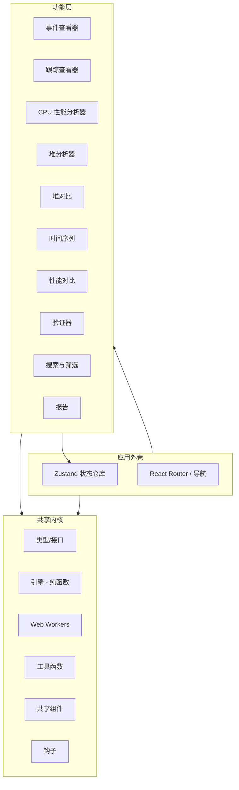

### 关键设计模式

| 模式 | 描述 |
|---------|------|
| **流水线引擎** | `标准化 → 配对 → 统计 → 索引` — 每个阶段都是纯函数，可独立测试 |
| **状态切片** | 每个功能在中央 Zustand 仓库中注册自己的切片——无循环依赖 |
| **Worker 工厂** | 从处理器函数生成类型安全的泛型 Worker 客户端 |
| **功能隔离** | 每个功能拥有自己的组件和逻辑，仅通过状态仓库共享 |

---

## 示例

示例数据文件位于 [`examples/`](./examples) 目录中：

| 文件 | 描述 | 尝试于 |
|------|------|--------|
| `examples/tracing-events.json` | mysql2 + ioredis 混合事件，包含死锁错误 | 事件查看器、跟踪查看器 |
| `examples/tracing-multi-lib.json` | pg + KafkaJS + Express 跨库跟踪 | 跟踪查看器、报告 |
| `examples/tracing-invalid.json` | 异常数据：孤立事件、重复开始、错误命名 | 验证器 |
| `examples/tracing-http-errors.json` | HTTP 错误场景（404/403/400/500、超时、负载过大） | 事件查看器、验证器、报告 |
| `examples/tracing-search-filter.json` | 8 个通道上 40+ 事件：不同耗时、错误和状态，用于搜索/筛选测试 | 搜索与筛选、事件查看器 |
| `examples/tracing-cross-lib.json` | 复杂的跨库异步链：Express → Auth → Redis → MySQL → Kafka | 跟踪查看器、事件查看器 |
| `examples/tracing-time-series.json` | 14 个操作的时间戳分散事件，用于吞吐量和延迟分布分析 | 时间序列、事件查看器 |
| `examples/tracing-perf-before.json` | 基线跟踪数据：5 个请求，未优化的查询（慢 JOIN、SELECT *、无缓存） | 性能对比、跟踪查看器 |
| `examples/tracing-perf-after.json` | 优化版本：查询改进、列选择、7 天筛选，延迟降低约 40-50% | 性能对比、跟踪查看器 |
| `examples/cpu-profile-sample.cpuprofile` | 400 样本 CPU 性能分析，模拟带数据库查询、认证和缓存的 Express 应用 | CPU 性能分析器 |
| `examples/heap-sample.heapsnapshot` | 最小 5 节点堆快照链（AppCache → DataStore → SessionManager → LargeBuffer） | 堆分析器 |
| `examples/heap-express-app.heapsnapshot` | 真实的 Express 应用堆：闭包、事件监听器、大缓冲区、缓存条目 | 堆分析器、堆对比 |
| `examples/heap-diff-before.heapsnapshot` | 前快照：11 个节点，小缓存（2 条目）和会话存储 | 堆对比 |
| `examples/heap-diff-after.heapsnapshot` | 后快照：18 个节点，增长的缓存（4 条目）+ 泄漏的事件监听器 | 堆对比 |
| `examples/heap-string-leak.heapsnapshot` | 22 节点堆，包含拼接字符串、切片字符串和大字符串缓存，用于测试字符串分析 | 堆分析器 |
| `examples/memory-timeline.json` | 16 个数据点的 process.memoryUsage() 时间序列，展示 15 秒内外部/RSS/堆的稳定增长 | 内存时间线 |
| `examples/gc-trace-gc.log` | 15 秒内 33 个 GC 事件（Scavenge + Mark-sweep），展示 4 倍堆增长 | GC 日志分析器 |

### 快速入门指南

**初次接触 NodeVerdict？** 按顺序尝试以下场景：

1. **事件查看器基础** → 上传 `examples/tracing-events.json` 查看时间线
2. **CPU 性能分析** → 上传 `examples/cpu-profile-sample.cpuprofile` 探索火焰图
3. **内存分析** → 上传 `examples/heap-sample.heapsnapshot` 查看泄漏检测
4. **堆对比** → 在堆对比中上传 `examples/heap-diff-before.heapsnapshot` 和 `heap-diff-after.heapsnapshot` 比较内存增长
5. **性能对比** → 在性能对比中上传 `examples/tracing-perf-before.json` 和 `tracing-perf-after.json` 查看优化效果
6. **时间序列** → 上传 `examples/tracing-time-series.json` 可视化吞吐量模式
7. **跨库跟踪** → 在跟踪查看器中上传 `examples/tracing-cross-lib.json` 查看瀑布图
8. **搜索与筛选** → 上传 `examples/tracing-search-filter.json` 测试全文搜索、正则表达式和耗时筛选
9. **分享结果** → 上传任意跟踪数据并进入报告，生成可分享链接或下载 HTML
10. **内存时间线** → 上传 `examples/memory-timeline.json` 可视化外部内存增长及 RSS/堆随时间的变化趋势
11. **GC 日志分析** → 上传 `examples/gc-trace-gc.log` 分析 GC 暂停时间和外部内存压力
12. **字符串泄漏检测** → 在堆分析器中上传 `examples/heap-string-leak.heapsnapshot` 查看外部内存统计和字符串分析
13. **实时监控** → 启动 `node server/live-agent.mjs --port 9876`，从实时监控页面连接，实时监控正在运行的 Node.js 进程

---

## 浏览器支持

| 浏览器 | 支持 |
|---------|------|
| Chrome 80+ | ✅ 完整支持 |
| Firefox 80+ | ✅ 完整支持 |
| Safari 14+ | ✅ 完整支持 |
| Edge 80+ | ✅ 完整支持 |

---

## 开发

### 项目脚本

| 命令 | 描述 |
|---------|------|
| `npm run dev` | 启动 Vite 开发服务器，支持 HMR |
| `npm run build` | TypeScript 检查 + 生产构建 |
| `npm run preview` | 本地预览生产构建 |

### 技术栈

| 组件 | 选择 | 理由 |
|-----------|------|------|
| UI 框架 | React + TypeScript | 稳定的生态系统 |
| 构建工具 | Vite | 快速 HMR，对 GitHub Pages 友好 |
| 样式 | Tailwind CSS v4 | 工具优先，快速 UI 开发 |
| 状态管理 | Zustand | 最少的样板代码，支持切片 |
| 压缩 | lz-string | 对 URL 友好的报告分享 |
| 可视化 | D3.js（火焰图、瀑布图、图表）/ ECharts（概览） | 为每种图表类型量身定制 |

---

## 常见问题

**问：这会把我的数据发送到任何地方吗？**  
答：不会。所有分析完全在浏览器中运行。没有数据被上传到任何服务器。实时监控功能通过 WebSocket 连接到本地代理，但数据始终停留在你的本地网络中。

**问：支持哪些文件格式？**  
答：TracingChannel 事件的 JSON 文件（最大 3GB，通过 Web Worker 流式处理）、用于堆分析的 `.heapsnapshot` 文件（最大 3GB）、用于 CPU 性能分析的 `.cpuprofile` 文件（最大 3GB）、用于内存时间线的 `process.memoryUsage()` JSON 数组，以及用于 GC 分析的 `--trace-gc` 日志文件。

**问：我可以将其用于生产环境监控吗？**  
答：实时监控功能通过 WebSocket 提供实时诊断，无需重启进程——适用于在预发或生产环境中按需调试。对于持久的生产监控，请考虑专用的 APM 工具。

**问：如何从我的 Node.js 应用程序生成 TracingChannel 事件？**  
答：在你的 Node.js 应用程序中订阅 `diagnostics_channel` 通道，并将捕获的事件导出为 JSON。详情请参阅 [Node.js diagnostics_channel 文档](https://nodejs.org/api/diagnostics_channel.html)。

**问：如何生成用于分析的 CPU 性能分析文件？**  
答：使用 `--cpu-prof` 标志运行你的 Node.js 应用程序：`node --cpu-prof app.js`。这会生成一个 `.cpuprofile` 文件。或者，使用 Chrome DevTools 的 Performance 标签 → "Start profiling" → "Download CPU profile"。

**问：如何生成堆快照？**  
答：使用 `node --heapsnapshot-signal=SIGUSR2 app.js` 并发送信号，或在代码中调用 `v8.writeHeapSnapshot()`。生成的 `.heapsnapshot` 文件可以直接加载到 NodeVerdict 中。

**问：堆分析器和堆对比有什么区别？**  
答：堆分析器检查单个快照，查找热点对象和可疑泄漏。堆对比比较两个快照（前后），以发现内存增长、新对象类型和释放的内存。

**问：性能对比功能展示什么？**  
答：它并排比较两组跟踪事件数据集。你可以查看每个通道的延迟变化、错误率差异和总体耗时差异——适用于 A/B 测试性能优化效果。

**问：可以使用正则表达式跨事件搜索吗？**  
答：可以。搜索与筛选页面支持正则表达式模式、大小写切换、耗时范围、状态筛选和时间范围筛选。

**问：离线 HTML 报告包含哪些信息？**  
答：导出的 HTML 报告包含关键发现、按通道统计（操作数、平均耗时、P95、错误数）、堆分析摘要（如有）以及专业样式——全部在一个独立的自包含文件中。

---

## 生态与时机

TracingChannel API 自 Node.js 18 起就已可用，但真正有意义的生态采用始于 2025 年底。主要库的迁移状态：

| 库 | 状态 | 周下载量 |
|---------|------|----------|
| mysql2 | ✅ 已合并（v3.20.0） | ~6000 万+ |
| node-redis | ✅ 已合并 | ~6000 万+ |
| ioredis | ✅ 已合并 | ~6000 万+ |
| pg（PostgreSQL） | 🔄 PR 已提交 | 主流 |
| Express | 🔄 PR 已提交 | 主流 |
| GraphQL | 🔄 PR 已提交 | 主流 |
| 跟踪 44+ 个库 | 10 个已合并，4 个 PR 已提交，8 个讨论中，22 个未开始 | |

**关键洞察**：当 mysql2 推出 TracingChannel 支持后，社区独立构建了 `mysql2-otel-instrumentation`——一个纯粹的 `diagnostics_channel` 订阅者，取代了猴子补丁式的 `@opentelemetry/instrumentation-mysql2`。这表明一旦库原生支持 TracingChannel，订阅者生态会自然涌现——但用于调试和可视化这些事件的工具仍然缺失。

---

## 许可证

[MIT](LICENSE)

---

## 贡献

欢迎贡献！如有任何错误、功能或改进，请提交 Issue 或 PR。